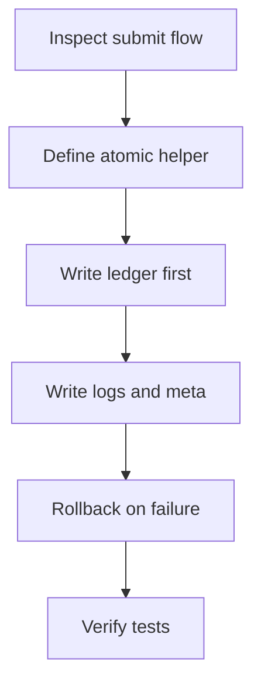
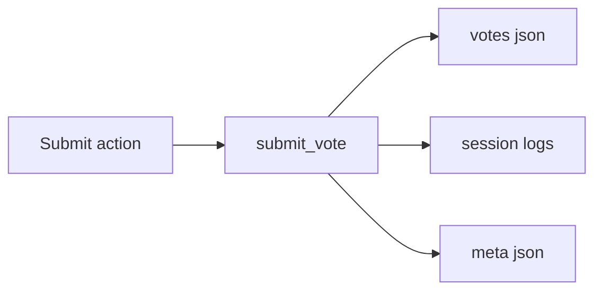
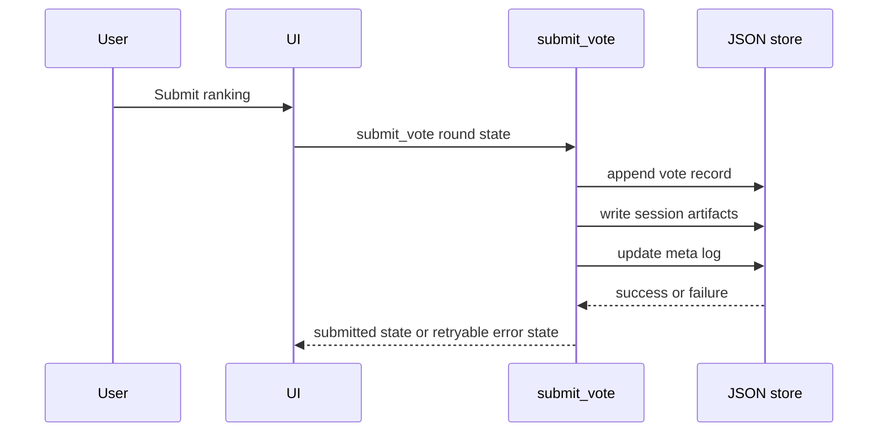

# Plan: Issue 8 Atomic And Retryable Vote Submission

## Human Summary

This change should tighten the vote submission path so the app only enters a terminal submitted state after every required write succeeds. Right now the flow updates session artifacts and `arena_logs/meta.json` before the canonical `votes.json` append, which means a late failure can leave the leaderboard and logs ahead of the vote ledger while the UI refuses retry. The safest implementation shape is to introduce a single submission transaction helper in `arena/app.py` that builds the final payload once, writes `votes.json` first as the canonical ledger, then writes session artifacts and meta state, and rolls back any already-written artifacts if a later step fails. The order matters because the tests already codify the broken append-failure behavior, so the first implementation pass needs to preserve the current success path while deliberately changing the failure semantics and the returned round state.

## Decision Log

| Decision | Choice | Why | Confidence |
|---|---|---|---|
| Canonical persistence source | Treat `votes.json` as the source of truth for submitted votes | The issue is about ledger integrity and retryability; the UI should not become terminal before the ledger write succeeds | High |
| Submitted state timing | Set `submitted=True` only after all required persistence completes | This keeps the round retryable after any partial failure and matches the issue acceptance criteria | High |
| Scope of repair work | Future submissions only | Existing inconsistent data is a separate operational concern and would expand this issue into reconciliation tooling | High |
| Failure handling for partial writes | Roll back any session/meta artifacts created after the ledger append if a later step fails | This keeps persisted outputs logically aligned without needing a new repair flow in this issue | Medium |

## Agent Task List

- [ ] `inspect-submit-vote-contract` Confirm all current callers and UI helpers that depend on `submitted`, `session_dir`, `submission_status`, and `submission_message`.
- [ ] `design-atomic-helper` Refactor the persistence steps in `arena/app.py` into a single helper that owns write ordering, rollback, and returned state data.
- [ ] `write-vote-ledger-first` Change submission flow so the canonical vote record append succeeds before the round can become terminally submitted.
- [ ] `stage-session-and-meta-writes` Rework session artifact and meta-log writes so they happen under the same helper and can be cleaned up on failure.
- [ ] `preserve-retryable-ui-state` Update `submit_vote()` failure paths so append, session, or meta failures return a non-submitted round state that can be retried from the same UI state.
- [ ] `update-helper-tests` Adjust unit coverage for persistence helpers if helper signatures or behavior change.
- [ ] `rewrite-integration-failure-tests` Replace the existing append-failure expectation with atomic rollback and retryable-state assertions, and add coverage for meta-write failure after ledger success if needed.
- [ ] `run-targeted-verification` Run the relevant vote submission test slice and fix any regressions in leaderboard or status-message behavior.

## File Impact Matrix

| File / Area | Action | Purpose | Risk |
|---|---|---|---|
| `arena/app.py` | Modify | Introduce the atomic submission helper, reorder writes, and keep failure states retryable | High |
| `arena/state/round.py` | Inspect | Confirm whether existing round-state fields are sufficient for rollback and retry semantics | Medium |
| `tests/integration/test_vote_submission.py` | Modify | Update integration assertions to enforce atomic persistence and retry behavior | High |
| `tests/unit/app/test_helpers.py` | Modify | Keep helper-level persistence tests aligned with any new helper contract | Medium |
| `tests/unit/app/test_payloads.py` | Inspect | Confirm payload and meta-log helper expectations still match the new flow | Low |

## Risk Matrix

| Risk | Level | Why it matters | Mitigation |
|---|---|---|---|
| Ledger-first flow still leaves residual artifacts after a later failure | High | The core bug would remain, just in a different order | Make rollback explicit in one helper and assert filesystem cleanup in integration tests |
| Meta-log updates drift from the canonical vote record schema | Medium | Leaderboard and round summaries could become inconsistent even if writes succeed | Reuse the same round-state inputs for record and meta construction, and verify both outputs in success-path tests |
| Retry path accidentally mutates the round state needed for a second submission attempt | Medium | The user could still be blocked after a failure even if `submitted` is false | Preserve ranking choices and round identifiers on failure-path outputs, and assert the state remains votable |
| Refactor breaks current success-path UI messaging | Low | Users may see incorrect status banners or missing session links after a valid submit | Keep existing success assertions intact and rerun the happy-path integration test |

## Test / Verification Plan

### Manual Checks

- [ ] `verify-submit-retry-state` Trigger a simulated persistence failure and confirm the returned round state remains non-submitted and still contains the existing vote choices.
- [ ] `verify-success-banner` Submit a normal vote and confirm the UI still shows the success banner and refreshed leaderboard.

### Automated Checks

- [ ] `verify-vote-submission-tests` Run `pytest tests/integration/test_vote_submission.py`.
- [ ] `verify-helper-tests` Run `pytest tests/unit/app/test_helpers.py tests/unit/app/test_payloads.py`.

## Acceptance Criteria

- [ ] A `votes.json` append failure leaves the round non-submitted and retryable from the same UI state.
- [ ] A session-artifact or `arena_logs/meta.json` failure does not leave persisted outputs that claim a vote succeeded when the round remains non-submitted.
- [ ] A successful submission still writes `votes.json`, session artifacts, and `arena_logs/meta.json`, and still updates the leaderboard.
- [ ] Integration tests explicitly cover append failure, meta-write failure, and successful submission under the new atomic contract.

## Assumptions and Unknowns

### Assumptions

- `submit_vote()` in `arena/app.py` is the only write path for vote persistence.
- No external consumer relies on partially written session artifacts appearing before `votes.json` is updated.
- Keeping the current JSON-file storage model is in scope; this issue does not introduce a database or file-locking redesign.

### Unknowns to Resolve First

- [ ] `unknown-session-link-contract` Confirm whether any UI element or downstream logic requires `session_dir` to be populated only on successful submission.

## Stop Conditions

Stop and ask for review if:

- Existing code outside `submit_vote()` mutates `arena_logs/meta.json` or `votes.json` in a way that conflicts with a single-helper transaction boundary.
- Making writes effectively atomic requires a broader persistence redesign such as temp-file swaps across multiple modules.
- You find existing saved data fixtures or tests that intentionally depend on partially persisted failed submissions beyond the current integration test.

## Agent Handoff Prompt

Execute this plan phase by phase. Resolve the `session_dir` contract first, then refactor the vote submission path into a single persistence helper that writes the canonical ledger first, cleans up partial artifacts on failure, and only returns `submitted=True` after all writes succeed. Update the existing integration tests to lock in the new retryable failure behavior before finishing with targeted verification.

## Additional Context

Issue framing

Issue #8 identifies a split-brain condition in the current flow: `_write_round_logs()` updates session artifacts and `meta.json`, then `_append_vote_record()` can fail afterward while `submit_vote()` still returns a submitted round state. The plan intentionally keeps scope narrow by fixing future submissions only and leaving historical repair work out of band.

## Execution Map

## Architecture Sketch

## Sequence Diagram

## Phase Timeline

### Phase 1: Confirm Contracts

Goal: Lock down the round-state and helper contracts that the refactor must preserve.

- [ ] `phase-confirm-state-contract` Inspect `submitted`, `session_dir`, and banner behavior expectations before changing write order.

### Phase 2: Refactor Persistence

Goal: Move vote submission persistence under a single atomic helper with rollback.

- [ ] `phase-build-transaction-helper` Implement the helper that owns write ordering and cleanup.
- [ ] `phase-wire-submit-vote` Update `submit_vote()` to consume the helper and return retryable failure states.

### Phase 3: Lock In Behavior

Goal: Replace the old failure expectations with tests that enforce the new contract.

- [ ] `phase-update-tests` Update integration and helper tests for append failure, meta failure, and success.
- [ ] `phase-run-targeted-tests` Run the targeted pytest commands and resolve regressions.
