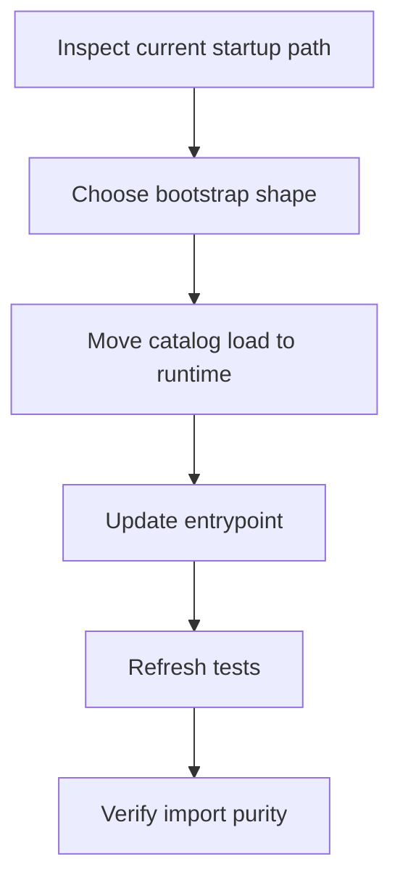
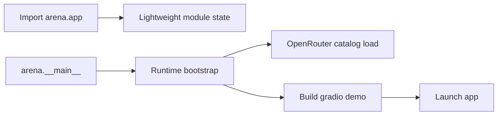
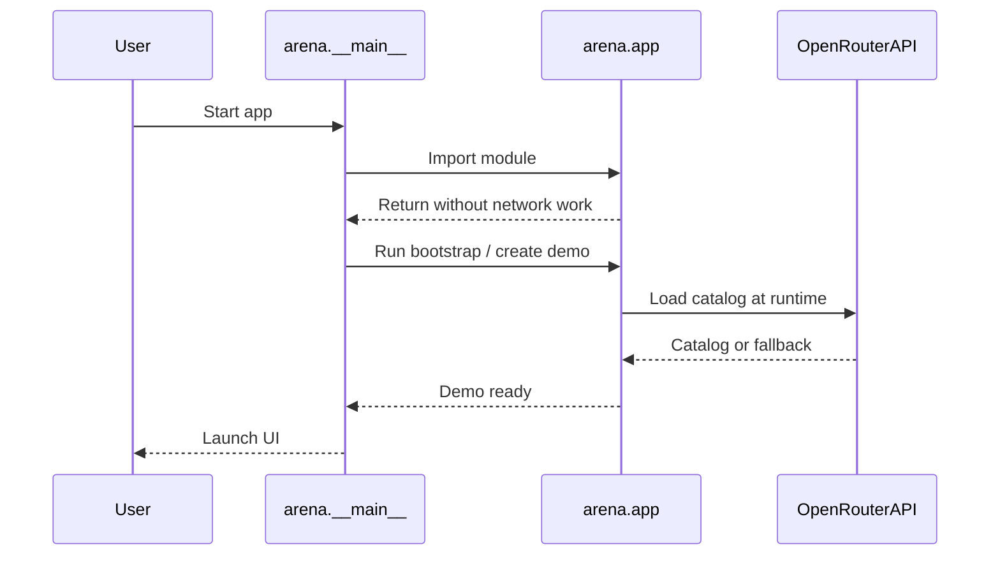

# Plan: Remove import-time OpenRouter and environment work from `arena.app`

## Human Summary

`arena.app` currently does too much work while the module is being imported. It loads environment state, resolves the OpenRouter catalog, and builds app-level globals before anything has explicitly asked for startup. That makes plain imports slower and less predictable, and it forces tests and tooling to tolerate OpenRouter and environment behavior even when they only need local helpers.

The fix should move that work behind an explicit startup boundary. The safest order is:

1. Make the app importable without resolving OpenRouter or loading environment configuration.
2. Move model-catalog initialization into the runtime startup path.
3. Keep the degraded-mode fallback behavior intact so the app still launches when the key is missing or invalid.
4. Tighten tests so they prove import purity and startup behavior separately.

The main thing to watch is how much of `arena.app` still depends on catalog-derived globals. If those globals stay at module scope, they will keep pulling startup work back into import time, so the plan needs a clean boundary there.

## Decision Log

| Decision | Choice | Why | Confidence |
|---|---|---|---|
| Startup boundary | Move OpenRouter catalog resolution out of `arena.app` import and into an explicit runtime bootstrap path | This is the direct fix for the import-time side effect and preserves startup behavior | High |
| App assembly shape | Prefer a small app initialization/factory layer instead of keeping catalog-backed globals at import time | A factory or bootstrap step keeps the module importable without network or environment work | Medium |
| Degraded mode | Preserve the existing fallback catalog and warning state during startup | The issue asks to remove import-time work, not to change startup semantics | High |
| Test strategy | Separate import-purity checks from startup-behavior checks | This protects the new boundary and prevents regressions | High |

## Agent Task List

- [x] `map-import-boundary` Identify the smallest safe runtime boundary for catalog loading and app assembly.
- [x] `design-bootstrap-shape` Decide whether the app should expose a startup function, factory, or cached initializer.
- [x] `refactor-app-init` Move catalog-dependent initialization out of `arena.app` import time.
- [x] `update-entrypoint` Make `arena.__main__` perform the explicit bootstrap before launching the demo.
- [x] `adjust-tests` Update startup and smoke tests to reflect the new boundary.
- [x] `extend-import-purity` Add or tighten a test that proves importing `arena.app` does not trigger OpenRouter or environment work.
- [x] `verify-runtime-startup` Run the relevant test subset and a minimal import/startup check.

## File Impact Matrix

| File / Area | Action | Purpose | Risk |
|---|---|---|---|
| `arena/app.py` | Modify | Remove import-time model catalog initialization and keep UI assembly compatible with the new startup flow | High |
| `arena/__main__.py` | Modify | Perform explicit runtime bootstrap before `demo.queue().launch()` | Medium |
| `arena/core/models.py` | Inspect | Confirm whether any helper should be split so env loading stays runtime-only and not import-adjacent | Medium |
| `tests/integration/test_import_purity.py` | Modify | Assert import purity without persistence-file creation or OpenRouter dependence | Medium |
| `tests/integration/test_smoke.py` | Modify | Reflect the new startup path and preserve selector/readiness expectations | Medium |
| `tests/integration/test_generation_flow.py` | Inspect/Modify | Update any assumptions about `OPENROUTER_API_KEY` or startup-initialized globals | Medium |
| `README.md` | Optional Modify | Only if startup instructions or degraded-mode behavior need a wording update after the refactor | Low |

## Risk Matrix

| Risk | Level | Why it matters | Mitigation |
|---|---|---|---|
| UI globals still depend on import-time catalog state | High | The fix will not actually remove the side effect if the module keeps building catalog-backed globals at import | Introduce a single runtime bootstrap boundary and pass state into app assembly |
| Startup behavior regresses in degraded mode | High | Users still need the app to launch when `OPENROUTER_API_KEY` is missing or invalid | Preserve the fallback model catalog and verify both valid-key and no-key startup paths |
| Existing tests rely on import-time side effects | Medium | Tests may fail or produce false positives if they still patch before import | Update tests to patch or inject at the new startup boundary |
| Import purity is only partially fixed | Medium | Environment reads could move but network calls could remain through another code path | Add a dedicated no-import-side-effects test that runs in a clean subprocess |
| Refactor touches more files than expected | Medium | A factory-based change may require coordinated updates across startup, tests, and docs | Keep the first pass narrow and stop if the boundary becomes much larger than planned |

## Test / Verification Plan

### Manual Checks

- [x] `check-clean-import` Start a clean Python process and import `arena.app` with `OPENROUTER_API_KEY` unset or empty; confirm no network-dependent behavior is triggered during import.
- [x] `check-startup-path` Launch the app through the normal entrypoint and confirm the UI still initializes with the expected model selectors and degraded-mode warnings.

### Automated Checks

- [x] `run-import-purity` Run `tests/integration/test_import_purity.py` after the refactor.
- [x] `run-smoke-tests` Run the relevant smoke tests that validate selector state and startup behavior.
- [x] `run-generation-flow` Run the targeted generation-flow tests that depend on `OPENROUTER_API_KEY` handling.

## Acceptance Criteria

- [x] Importing `arena.app` does not perform OpenRouter network I/O.
- [x] Importing `arena.app` does not depend on `OPENROUTER_API_KEY` being present or valid.
- [x] The normal app entrypoint still initializes the model catalog before launch.
- [x] Degraded mode still works when the key is missing or invalid.
- [x] Tests explicitly cover the import-purity boundary and the startup path.

## Assumptions and Unknowns

### Assumptions

- The intended fix is a startup/refactor change, not a behavior change to the OpenRouter integration itself.
- Current degraded-mode behavior should remain user-visible after the refactor.
- The repository should keep the existing `python -m arena` and console-script startup flow.

### Unknowns to Resolve First

- [x] `bootstrap-shape` Use `initialize_model_catalog()` for runtime catalog loading and `create_demo()` for Gradio app construction.
- [x] `state-location` Keep catalog-derived state in `arena.app` module globals, updated by the explicit initializer, to minimize changes to existing callbacks.
- [x] `test-boundary` Import-purity tests assert no persistence creation, no demo construction, and no catalog/env work during import.
- [x] `docs-update` No README update is needed because user-facing startup commands and degraded-mode behavior are unchanged.

## Stop Conditions

Stop and ask for review if:

- The refactor requires a broad API reshaping beyond moving startup work out of import time.
- The app cannot remain compatible with the existing entrypoint without introducing fragile global state.
- The implementation path would require changing unrelated OpenRouter request logic instead of just the startup boundary.

## Agent Handoff Prompt

Execute this plan phase by phase. Start by resolving unknowns, then complete tasks in order. Do not skip the acceptance criteria or verification plan. If a stop condition is hit, pause and report the finding before continuing.

Additional context

Issue #11 specifically points at `arena/app.py:82` as the import-time call site, with the environment and OpenRouter side effects living in `arena/core/models.py`. The current normal startup path goes through `arena.__main__`, which already bootstraps persistence before launching the demo. That makes the entrypoint the natural place for explicit initialization if the app factory moves out of import time.

## Execution Map

## Architecture Sketch

## Sequence Diagram

## Phase Timeline

### Phase 1: Resolve the startup boundary

Goal: Confirm the narrowest safe way to delay catalog loading until runtime.

- [x] `phase1-confirm-boundary` Decide how the app should receive catalog state at startup.
- [x] `phase1-confirm-entrypoint` Confirm where bootstrap belongs so the existing launch flow stays intact.

### Phase 2: Implement the refactor

Goal: Move catalog/environment work out of import time and onto the startup path.

- [x] `phase2-refactor-app` Update `arena.app` and `arena.__main__` to use the chosen bootstrap shape.
- [x] `phase2-update-tests` Adjust tests for import purity and startup behavior.

### Phase 3: Verify and review

Goal: Prove the refactor preserved behavior while removing the import-time side effect.

- [x] `phase3-run-verification` Run the targeted tests and a clean import/startup check.
- [x] `phase3-review-results` Summarize any remaining risks or follow-up work before implementation proceeds further.
